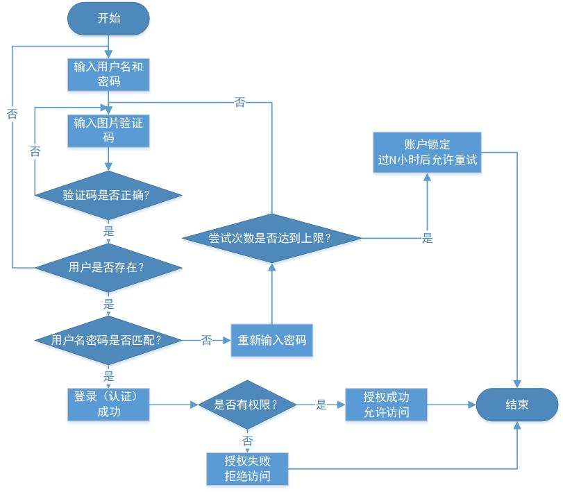
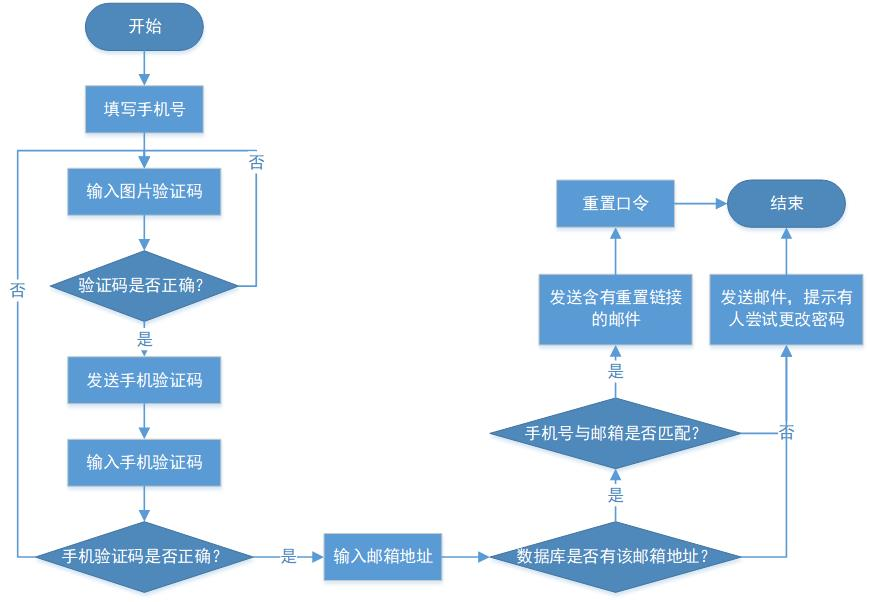
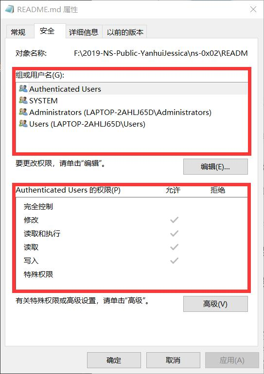
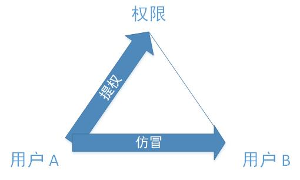

# 操作系统的访问控制设计实例研究

## 实验环境

- 操作系统版本：Android 8.0.0
- 硬件设备型号：HUAWEI NOVA 2 PLUS BAC-AL00
- 是否默认设置：是
- 支持的生物特征解锁方式：指纹

## 实验探索

- **当系统处于锁屏状态下无法进行截屏**，截屏快捷键使用无效，包括以未解锁状态进入可访问的计算器、录音等 APP 页面时
- 当系统处于锁屏状态下接收到新短信时，不解锁情况下「只知道新消息的个数，不知道与消息有关的任何信息」
  - [ ] 允许查看短信内容
  - [ ] 允许回复短信
  - [ ] **微信电话本**在接管了系统短信功能和权限之后，是否会有一些不同的功能设定
    - 接管后，连锁屏界面的消息通知都没有了
- 当系统处于锁屏状态下，使用系统内置语音助手可以完成以下哪些操作？「除了说电话号码或正确的联系人，语音助手只会没有感情地回复『没有听清联系人』」
  - [ ] 访问通讯录
  - [x] 拨打电话（需要知道电话号码或通讯录中联系人名）
  - [ ] 访问相册
  - [ ] 查看短信收件箱
- 请实验并分析指纹识别相比较于简单密码、复杂密码、图形解锁、人脸识别解锁、声纹解锁等解锁方式的安全性、便利性差异

  解锁方式 | 安全性 | 便利性
   ----- | ----- | -----
  简单密码 | 极低，易被暴力破解，跟指纹识别解锁没有可比性 | 一般，就算再简单，每次解锁都要敲，反反复复敲总会觉得烦的
  复杂密码 | 中下，密码符号集合有穷性，相对于指纹识别解锁，在无任何已知信息的情况下，存在暴力破解可能；若存在针对性，则破解可能性提高 | 输入耗时长，不容易记忆（容易记忆则存在规律性，易被破解）
  图形解锁 | 低，别人可能从你的动作中看出解锁图形！（输入界面相比密码更容易被看到）图形的最大复杂度受到点的个数的限制，易被穷举破解 | 单手持手机画图不易，手机卡顿、相隔较远时容易连错点（~~亲身体会QAQ~~）
  人脸识别 | 中等，人脸特征在成长过程中会有明显变化，不像指纹可以长期保持稳定特征。可能可以通过照片解锁，双胞胎之间也可能互相解锁 | 方便，但可能会因某些因素影响导致识别不灵
  声纹解锁 | 中等，可能通过录音或伪音冒充解锁 | 要发出声音，在安静的时候比较尴尬，吵杂的时候不易解锁
  指纹解锁 | 高，指纹虽然日常生活中易获取，但不像人脸和声纹容易伪造，特征长期保持稳定，人与人之间差异明显 | 较为方便，但手指不干净时会导致解锁失败
- 总结：华为在信息安全方面做得不错！（~~mis0x03不应该吐槽的~~）

## 思考题

### 以上设计实现方式属于我们课堂上讲过的哪种强制访问控制模型？Lattice/BLP？Biba？

基本属于 Biba 模型。在未解锁时，用户级别低，可以了解任意级别新信息条数，为**上读**；解锁后，用户级别高，可以编辑发送信息，为**下写**。

### 系统或第三方应用程序是否提供了上述功能的访问控制规则修改？如果修改默认配置，是提高了安全性还是降低了安全性？

系统本身未提供。**微信电话本**成为默认短信应用后，可能因为权限不够，连锁屏界面的新消息提示都没有了。可见，修改默认配置，可能提高安全性，也可能降低安全性。

## 课后题

### 生物特征身份认证方式有哪些？优缺点分析？应用场景举例。

常见的生物特征身份认证方式有指纹识别、人脸识别、虹膜识别、声纹识别等。

#### 指纹识别

- 优点：唯一性；复杂程度为鉴别提供足够的特征；识别速度快；接触读取可靠性高
- 缺点：某些群体指纹特征少；接触留下指纹痕迹，可能被采集复制
- 应用：身份标识、电子设备指纹解锁；指纹对比确定嫌疑犯等

#### 人脸识别

- 优点：自然性，识别方式同人类（甚至其他生物）进行个体识别时所利用的生物特征相同；不被被测个体察觉
- 缺点：不同个体之间的区别不大，不易区分；人脸外形受到内外多种因素的影响，增大识别难度
- 应用：快速身份识别，通过闸门监控视频图象中实时查找人脸；电子设备人脸识别解锁

#### 虹膜识别

- 优点：使用方便；无需物理接触；可靠性非常高
- 缺点：设备造价高；镜头可能产生图像畸变而使可靠性降低；可能通过超高清图像完成验证
- 应用：电子设备虹膜识别解锁；身份标识、身份识别

#### 声纹识别

- 优点：获取语音的识别成本低廉，使用简单；适合远程身份确认；非接触、自然
- 缺点：声音易变性，受身体状况、年龄、情绪等多种因素影响；不同的麦克风和信道对识别性能有影响；环境噪音对识别有干扰；混合说话的情形下人的声纹特征不易提取
- 应用：身份认证与内容认证结合；声纹辨认技术可以察觉电话交谈过程中是否有关键说话人出现，继而对交谈的内容进行跟踪

### 绘制用户使用用户名/口令+图片验证码方式登录系统的流程图。考虑认证成功和失败两种场景，考虑授权成功和失败两种场景。

**（身份）认证-（访问）授权-（访问）审计**

### “找回口令功能”和“忘记密码”在访问授权机制中的意义？请尝试设计几种安全的“找回口令功能”，详细描述找回口令的用户具体操作过程。

> 认证的实现过程就是将主体（数字）身份标识唯一的绑定到（真实）主体的过程。 身份认证是访问授权的基础，没有身份认证就无法实现访问授权。

只有通过认证后的用户才能获得相应的权限，如果用户忘记密码，就无法通过认证并获得原先已有的权限。

「找回口令功能」和「忘记密码」实际上是在确认用户身份之后（认证），为其重置口令。目前「找回口令功能」还没有一个工业标准，但至少对用户身份进行非口令的认证需要多种因素结合才能达到相对的安全： 
- 双因素认证，先使用手机短信验证码进行身份确认，再向其给定的邮箱发送邮件，无论邮箱是否正确都要提示发送成功，但只有手机号和邮箱地址匹配的情况才能收到含有重置链接的邮件

- 或者填写邮箱后直接发送带有重置链接的邮件，但重置密码前需要回答密保问题

### Windows XP / 7 中的访问控制策略有哪些？访问控制机制有哪些？

- 采用自主访问控制（DAC: Discretionary Access Control），访问授权可以自主分配（授权和取消授权）
- 访问控制列表(ACL：Access Control List)
  - 自主访问控制列表，包含零或多个访问控制项
  - 系统访问控制列表，定义系统审计规则

  

### 用权限三角形模型来理解并描述下 2 种威胁模型：提权、仿冒。

STRIDE 威胁模型，用于帮助系统进行推理和查找威胁

威胁（Threat）	|	期望属性（Desired property）
-|-
仿冒	| 认证
篡改	| 完整性
否认 |	不可抵赖性
信息泄露  |	保密性
拒绝服务	| 可用性
提权	 |  授权

- 提权指用户获得了本不属于自己角色的权限，但是本身的角色并没有变化
- 仿冒指用户 A 以用户 B 的身份通过了认证，从而可以行使 B 的所有权利，没有改变角色本身可行使的权限

### 试通过操作系统的访问控制机制来达到预防一种真实病毒的运行目的。

- 通过强制访问控制可以防止木马病毒窃取操作权限
- 锁定注册表（~~感觉比较暴力~~），防止熊猫烧香添加开机自启动项

### 什么是 OAuth？

OAuth 是 Open Authorization 的简写，是关于用户资源授权的开放标准。OAuth 的授权标准中，第三方无需使用用户的用户名与密码就可以申请获得该用户资源的授权。 
通过 OAuth，我们可以使用一个账户授权登录多个不同的第三方应用。

### 什么是 OpenID？

OpenID 是一个以用户为中心的数字身份识别框架，用于认证用户所声明的身份是否真实。 由**身份提供者**（提供 OpenID URL 注册和验证服务的服务提供者）向**依赖方**（想要对最终用户的标识进行验证的网站）提供**标识**（最终用户用以标识其身份的 URL），证实**最终用户**（想要向某个网站表明身份的人）的身份

### 试用本章所学理论分析 OAuth 和 OpenID 的区别与联系。

- OpenID 侧重认证，OAuth 关注授权
- 在使用 OpenID 完成身份认证后，才能通过 OAuth 授予第三方应用访问受保护的信息的权限

### 如何使用 OAuth 和 OpenID 相关技术实现单点登录（Single Sign On）？

单点登录指用户可以一次登录就获得一个环境下所有相关系统的访问权限，无需进行单个系统、逐一登录。举个常见的例子，打开淘宝 APP，里面会有聚划算、天猫等服务链接，点击后会直接跳转，无需再次登录。

#### 使用 OAuth 和 OpenID 相关技术实现单点登录

- 用户完成认证后，认证服务提供者向客户端返回 authorization code，客户端使用 authorization code 向认证服务提供者交换 access token，并使用 access token 向服务提供者请求资源。服务提供者使用 access token 向认证服务提供者验证用户身份，确认无误后服务提供者向客户端发放相关资源
- access token 负责请求资源，通过 OAuth 实现
- 用户身份过期时，需要 refresh token，通过 OpenID 实现

## 参考资料

- [2018-NS-Public-jckling/ns-0x02](https://github.com/CUCCS/2018-NS-Public-jckling/blob/master/ns-0x02/2.md)
- [Automated fingerprint identification - Wikipedia](https://en.wikipedia.org/wiki/Automated_fingerprint_identification)
- [Everything you ever wanted to know about building a secure password reset feature](https://www.troyhunt.com/everything-you-ever-wanted-to-know/)
- [STRIDE (security) - Wikipedia](https://en.wikipedia.org/wiki/STRIDE_(security))
- [What the Heck is OAuth?](https://developer.okta.com/blog/2017/06/21/what-the-heck-is-oauth)
- [OpenID - Wikipedia](https://en.wikipedia.org/wiki/OpenID)
- [浅谈OAuth 和 OpenID 相关技术](http://m.sohu.com/a/280388046_505923)