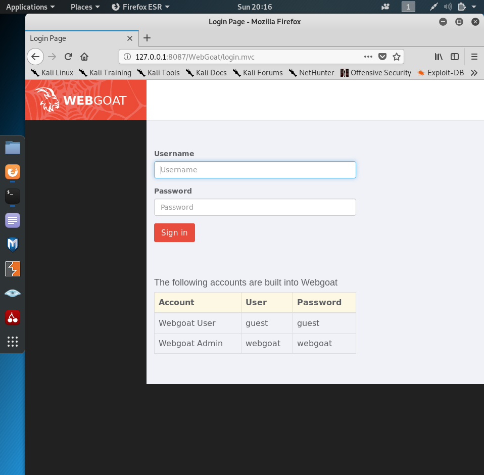
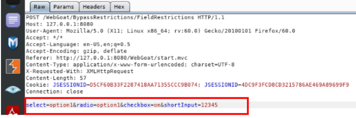
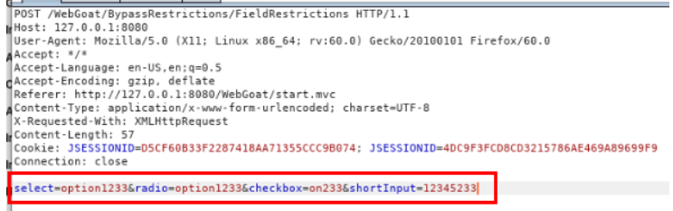
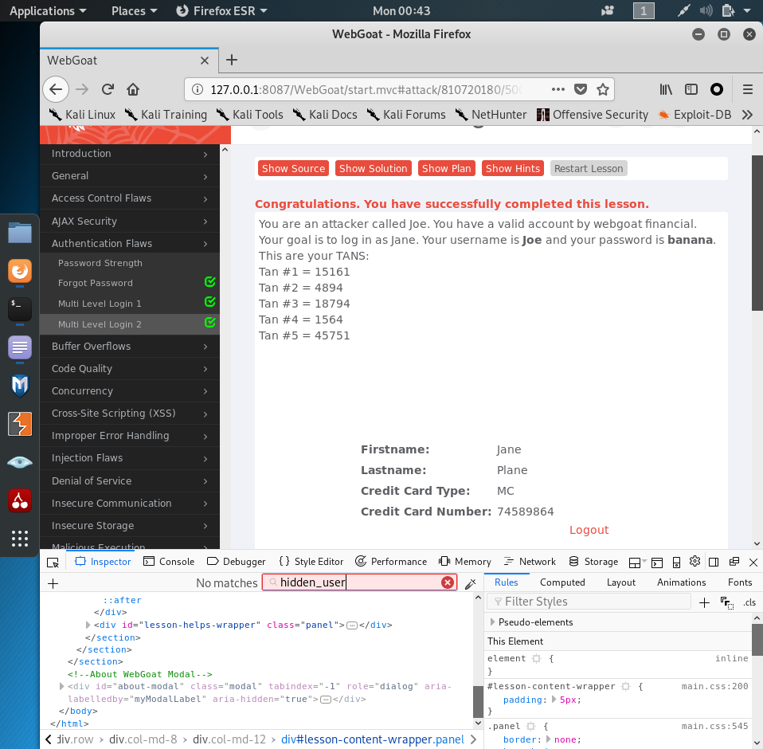

# Web应用漏洞攻防
## 实验目的
- 了解常见 Web 漏洞训练平台；
- 了解常见 Web 漏洞的基本原理；
- 掌握 OWASP Top 10 及常见 Web 高危漏洞的漏洞检测、漏洞利用和漏洞修复方法；
# 实验环境
- WebGoat
- Juice Shop
# 实验要求
  每个实验环境完成不少于 5 种不同漏洞类型的漏洞利用练习；
  # 实验过程
  # （一）webgoat环境下的漏洞攻防
  ## 搭配环境
  - 使用apt policy docker -compose指令查看是否安装，显示为none，则继续使用install指令安装

  
  - 查看docker镜像

  
  - 克隆老师的仓库到本地，并启动环境

  
  - docker ps指令查看三个镜像状况，WebGoat7.1对应8087端口，WebGoat8.0对应8088端口

  

  - 访问 WebGOAT7.1和8.0
     - 无需注册，直接访问
     
  

 - 需要注册
  
  # 【漏洞类型①：未验证的用户输入】
  - WebGoat环境下进行实验：Bypass HTML Field Restrictions & Exploit Hidden Fields
  ## Bypass HTML Field Restrictions & Exploit Hidden Fields：绕过前端限制
- 前端：Web浏览器，用户可以查看源码，可以修改html甚至脚本代码（可以修改表单字段限制等
- 后端：用户无法直接访问的服务器等
- 在浏览器添加插件ProxySwitchyOmega，并进行数据修改和设置
  
- 设置burpsuite的intercept is on，即相当于设置断点，方便调试、转发

  
- 在WebGoat-8.0提交表单（先不做修改）

  
- 发现在burp suite连接到了POST请求

  
- 不做修改的情况下进行forward，发现表单提交失败

  
- 修改每一个表单项的内容，让它突破html中的表单填写限制，进行forward

  
- 此时发现提交成功

  
- 由此可以了解到前端的限制其实就像个“摆设”，很容易突破
## Exploit Hidden Fields 绕过前端的校验
-  所有表单内容都符合校验标准的时候,提交
- 和上一过程同理，用burp suite进行拦截并且修改每一个表项内容，让其不符合校验标准，然后forward，该实验也就是为了说明前端的校验标准也容易被突破

  
  # 【漏洞类型②：跨站点脚本(XSS)】
  - WebGoat 7.0.1 环境进行实验：Phishing with XSS
  - 该实验通过XSS攻击受害者的cookie并发送到目标服务器
  

  - 用''''''指令弹出cookie值
  
  

  - 换成''''''代码，此时弹出网页URL值与刚才得到的cookie值相同，实验成功
  
  # 漏洞类型③：脆弱的访问控制】
  - 用WebGoat 7.0.1 环境做这个实验：Forgot Password & Multi Level Login 2
  
  
  ## Forgot Password 忘记密码 
   - 原理：Web提供忘记密码功能，但实现该功能的措施有时很脆弱，很容易被攻击
   - 实验目的：穷举进行攻击从而登录

     - webgoat登录时穷举喜欢的颜色很快成功并获得用户信息
  
     - 穷举admin最喜欢的颜色也得以获得用户信息
  
  ## Multi Level Login 多级登陆 
  - Multi Level Login 1 
    - 原理：多级登录提供了一个健壮的验证，加入了第二层的存档，在通过用户名和密码登录后，可以请求一个交易码，每个交易认证码只能用一次。
    - 目的：通过开发人员工具用已有的二级登录交易码登入他人账号
    - 黑客已知用户名Jane，其密码是tarzan，第一次登录交易码tan1=15648
    - 黑客尝试登录时需要输入tan2，但是黑客不知道，于是通过开发人员工具将tan2改成tan1
  
  - 此时在“Enter TAN #2"的输入栏中，输入tan1的值15648即可成功登录

  
- Multi Level Login 2 
  - 我们以 Joe 的账号进行登录，密码为banana。登录之后会发现要输入交易码，此时用开发人员工具将隐藏框内的 Joe 改为 Jane，输入交易码然后提交数据
  
  
  - 这时发现成功登陆Jane的账号，实验成功 

  
 ## 【漏洞类型④：脆弱认证和会话管理】
 - 用WebGoat 7.0.1 环境做这个实验：Session Fixation
 - 原理：服务器通过每个用户的唯一的Session ID 来确认其合法性。如果用户已登录，并且授权他不必重新验证授权时，当他重新登录应用系统时，他的Session ID 依然是被认为合法的。
  
- 伪造一个带有Session的链接发送给别人,在邮件内容后加&SID=xxxx……

  
- Janes收到这个邮件，点击链接并进行了登录,密码是tarzan

  
- 此时只需要用刚刚发送的Session值,就可以直接进入别人账户
  
  ## 【漏洞类型⑤： sql注⼊缺陷】
  - 用WebGoat 7.0.1 环境做这个实验：LAB: SQL Injection
  
  - 原登录界面如下图，此时黑客并不知道用户密码
  
  - 用Burp suite拦截提交，修改password内容为 ' or '1'='1
  - Burp suite 将修改后的内容forward，成功绕过认证登录，可以进行接下来的搜索、修改、创建、删除等操作
  # Juice Shop环境下的漏洞攻防
  - Juice Shop环境搭建，找到克隆老师的仓库的juice-shop文件夹并启动环境
  
  - 用docker ps 查看镜像的健康状况，juice-shop对应虚拟机3000端口
  
  - 访问入口地址，成功进入JuiceShop环境界面并注册登录
  
  - 在源代码中发现了计分板页面#/score-board

  
  - 然后访问此页面就可以看到所有的成就和每一关的要求，同时也通过了第一关
  
  ## 【漏洞类型①： sql注⼊缺陷】
  - 按照之前WebGoat实验的sql原理，首先尝试email用 ' or '1'='1,密码随便填，发现无法登陆
  
  - 换一种写法继续尝试，成功

  
 ## 【漏洞类型②：身份认证失效】
 - 目标：目标： 通过忘记密码，更改用户密码
 - 这里可以看到用户最喜欢的一只猫的信息
  
  - 尝试忘记密码并将猫的名字输入
  
  - 成功登录
  
  ## 【漏洞类型③：敏感数据曝光/遗忘信息】
  - 目标：Forgotten Sales Backup
  - 在/#/about 页面中通过开发者工具找到【使用条款】的对应href=“/ftp/legal.md”
  

- 推测所有的文件都存在于href="/ftp",去访问，发现推测成立
  
 -  点开优惠券的文件发现会报错
  
  - 用%2500阶段后缀名，然后可成功下载文件
   
  
  ## 【漏洞类型④：访问控制失效】
  - 用burpsuite抓包，点添加购物车后，抓包发现链接上有个/rest/basket/8，修改此处的8为其他数字。即可把商品加到他人购物车
   
 - 这里将数字修改改为15
  
  - 接下来forward，在我的购物车里并没有出现这个商品，实验成功。
  

  ## 【漏洞类型⑤：持续型XSS攻击】
  - 在提交注册表单的时候，通过Burp suite拦截
  
  - 将email内容修改
  
  - 按照之前的sql注入方法登录管理员账号，发现确实成功生成了这个存储型的XSS，实验成功 
  
  ## 参考文献
  - [如何搭建juice-shop](https://mp.weixin.qq.com/s?src=11&timestamp=1578574386&ver=2086&signature=qWPw0bSUbopjPDuyf7ajg*YwuMjVXXuBUse4viwBKAblonh8-MIOiYoka6Z1OS8Q06D06BbJpfp3QwtKUkJE7LeuX-M11889ZwCN*B6UUtYrPpkEFHP77aj*BHIdhPA3&new=1)
  - [同学的实验报告](https://github.com/CUCCS/2019-NS-Public-DXY0411/blob/aa76a2efbd4869f18ab7e4794f39d9853d17a9e1/ns_chap0x07/Web%20%E5%BA%94%E7%94%A8%E6%BC%8F%E6%B4%9E%E6%94%BB%E9%98%B2.md)