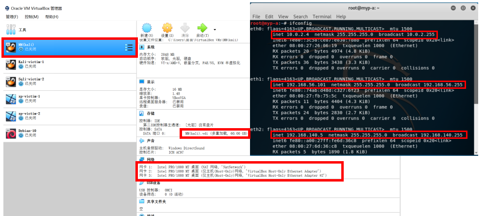

# **Chap0x01 基于 VirtualBox 的网络攻防基础环境搭建**
## **一、实验目的**

* 掌握 VirtualBox 虚拟机的安装与使用；

* 掌握 VirtualBox 的虚拟网络类型和按需配置；

* 掌握 VirtualBox 的虚拟硬盘多重加载；

## **二、实验环境**

以下是本次实验需要使用的网络节点说明和主要软件举例：

* VirtualBox 虚拟机

* 攻击者主机（Attacker）：Kali Rolling 2109.2

* 网关（Gateway, GW）：Debian Buster

* 靶机（Victim）：From Sqli to shell / xp-sp3 / Kali

## **三、实验要求**

1. 虚拟硬盘配置成多重加载;

2. 搭建满足拓扑图所示的虚拟机网络拓扑；

3. 完成以下网络连通性测试:
    - 靶机可以直接访问攻击者主机
    - 攻击者主机无法直接访问靶机
    - 网关可以直接访问攻击者主机和靶机
    - 靶机的所有对外上下行流量必须经过网关
    - 所有节点均可以访问互联网

## **四、实验过程及结果**

### （一）虚拟硬盘配置成多重加载
虚拟机安装完成后，点击“管理->虚拟介质管理->选择需要修改的虚拟硬盘”，将类型选择为“多重加载”，弹出提示框提示释放磁盘文件，选择“释放”。

此时再选中虚拟机“设置->存储->控制器最右侧按钮->选择对应.vdi文件”

此时可看到“多重加载模式”设置成功。

### （二）虚拟机环境搭建

#### 网络拓扑示意图

#### 网卡及网络设置

网络设置：设置->网络->网卡

* 攻击者主机(MM(kali))  
  三块网卡：NAT网络：10.0.2.4  
           Host-Only网络1：192.168.56.101  
           Host-Only网络2：192.168.140.5

* 网关(Debian-10)  
  四块网卡：NAT网络：10.0.2.15/24  
           Host-Only网络1：192.168.56.113/24  
           内部网络intnet1：172.16.111.1/24  
           内部网络intnet2：172.16.222.1/24

* 靶机(以xp-victim-1和Kali-victim-1为例)

    - xp-victim-1: 一块网卡   
    内部网络intnet1：172.16.111.121

  

- Kali-victim-1: 一块网卡   
    内部网络intnet1：172.16.111.142

### （三）网络连通性测试

1. 靶机可以直接访问攻击者主机

    靶机：Kali-victim-1  
    攻击者主机：MM(kali) (10.0.2.4)

靶机ping攻击者主机成功，说明在网络层靶机可以直接访问攻击者主机。  

【若用xp系统靶机，需先关闭防火墙，防止影响ping结果。】

2. 攻击者主机无法直接访问靶机

    靶机：Kali-victim-1 (172.16.111.142)  
    攻击者主机：MM(kali)

攻击者主机ping靶机失败，说明在网络层靶机无法直接访问攻击者主机。

3. 网关可以直接访问攻击者主机和靶机

    网关：Debian-10  
    攻击者主机：MM(kali) (10.0.2.4)  

网关ping攻击者主机成功。

    靶机：Kali-victim-1 (172.16.111.142)

网关ping靶机成功。

4. 靶机的所有对外上下行流量必须经过网关

    靶机：Sqli-victim-2

【tcpdump -i enq0s10 对应网关内网模式Internet2网卡】

ping靶机的同时网关监听，结果如下：

两次均成功抓包，说明靶机的所有对外上下行流量经过了网关。

5. 所有节点均可以访问互联网

- 攻击者主机ping百度

 - 网关ping百度

 

 - 靶机ping百度

 

 所有抓包均成功，说明所有节点均可以访问互联网。

 ## **五、本实验拓扑结构**

 